<!-- 

https://learn.microsoft.com/en-us/dotnet/csharp/asynchronous-programming/async-scenarios

https://github.com/davidfowl/AspNetCoreDiagnosticScenarios/blob/master/AsyncGuidance.md

https://blog.stephencleary.com/2012/07/dont-block-on-async-code.html


https://techblog.criteo.com/understanding-reversed-callstacks-in-visual-studio-and-perfview-with-async-await-code-11ebe5769332

https://learn.microsoft.com/en-us/shows/on-dotnet/writing-async-await-from-scratch-in-csharp-with-stephen-toub

https://devblogs.microsoft.com/dotnet/how-async-await-really-works/

https://medium.com/@josesousa8/demystifying-synchronization-context-in-net-7ddf4473efcb

-->
# Async/await Workshop

- Async/await flow 
- SyncronizationContext
- Exceptions, eliding async/await, async void

- Async composition
- CancellationTokens

- Allocation optimizations with ValueTask, IValueTaskSource
- _Asyncify_ with ValueTaskCompletion

- Asynchronous streams


<!-- 
- scop async/await - insiruire secventiala de statementuri
- abstractizare -> substraturi
-->


---

### Types of async
<!-- 
Ce scenarii acopera programarea asincrona prin async/await?
- cod cpu intensive - raport/calcule
 -->


- _**CPU-bound code**_ - await an operation that is started on a background thread with the **Task.Run** method

```c#
private decimal CalculateTotalPrice()
{
    // Does an expensive calculation and returns
    // the result of that calculation.
}

calculateButton.Clicked += async (o, e) =>
{
    // This line will yield control to the UI while CalculateTotalPrice()
    // performs its work. The UI thread is free to perform other work.
    var totalPrice = await Task.Run(() => CalculateTotalPrice());
    DisplayTotalPrice(totalPrice);
};
```

---
### Types of async

- _**I/O-bound code**_ - await an operation that returns a **Task** or **Task<T>** inside of an async method

```c#
private readonly HttpClient _httpClient = new HttpClient();

public async Task<int> GetDotNetCount()
{
    var html = await _httpClient.GetStringAsync("https://dotnetfoundation.org");

    return Regex.Matches(html, @"\.NET").Count;
}
```
<!-- 
cod I/o bound: citim/scriem (db, disk, fileserver, httpreq)
-->

---

# What is a Task?

A task is an abstraction over a piece of code which can be waited
asynchronously.

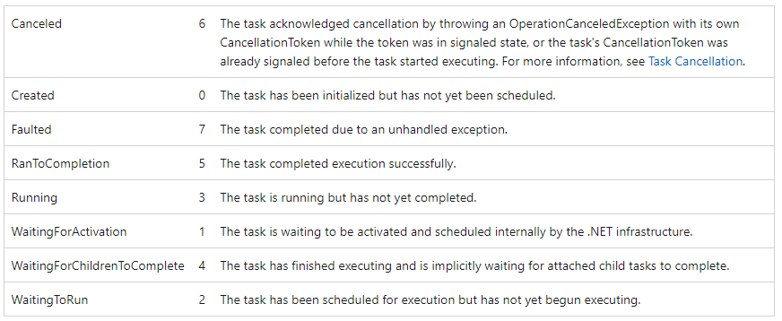
<!-- 
- abstraction
- 4 statusuri importante
 -->
---

## Async await flow

---

### Async await flow

Microsoft docs. affirmations:

- _doesn't block the current thread while the awaited task is running_
  <br/>
- _returns control to the caller of the async method_

```c#
public async Task<int> GetDotNetCountAsync()
{
    var html = await _httpClient.GetStringAsync("https://dotnetfoundation.org");

    return Regex.Matches(html, @"\.NET").Count;
}
```
  <!--
  - prima afirmatie: task is running suna ca si cum e un thread 
  - If it doesn't block the current thread, then why return to the caller and what does it mean? If there's no thread waiting for writing to db, to disk or waiting for a web request.
  - sa ne imaginam n functii async
  - Care are fi flowul de executie?
  -->

---

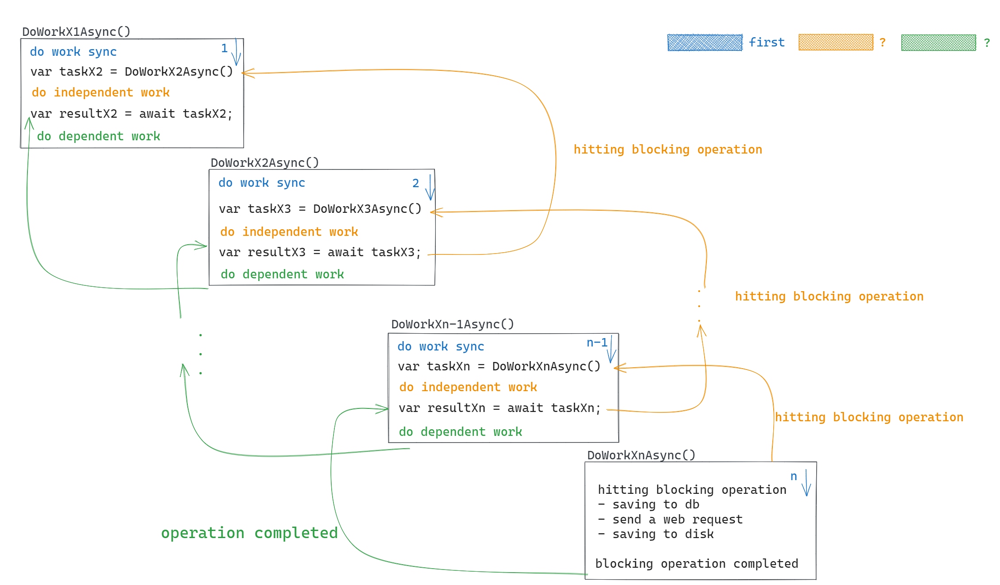

<!--
n functii x1->xn async
sa punctez unde intervin cele 2 afirmatii
vom face distinctia dintre 3 tipuri de cod, colorate diferit
sync-sync-sync all normal
Xn- last op
cele 2 afirmatii
return control = return Task in Running 
-->

---

### Async await flow - Demo
<!-- 
- 5000
- 0 - sincron - async state machine check
- al 3-lea scenariu
Ce s-ar intampla daca in timp ce cod independent din metoda x1 de ex se executa, si intre timp operatia blocanta finala intoarce un rezultat (este intors rezultatul unui query)

- se intrerupe executia codul independent?
- se asteapta terminarea codului independent si apoi..
- sau independent un thread va intra in x3
 -->
---

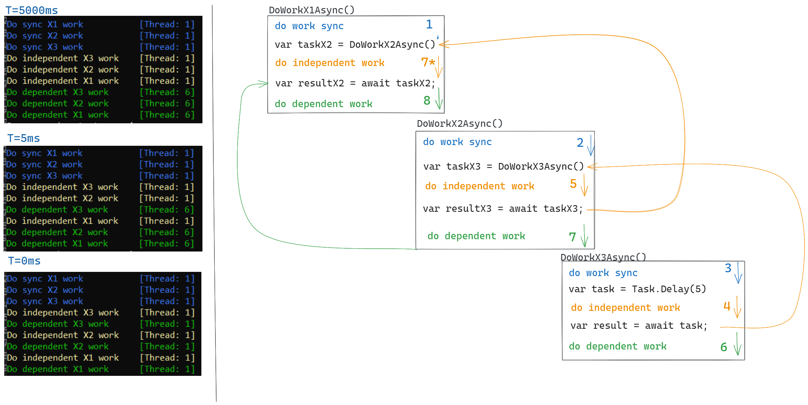

---

### Async await parallelisation effect - Demo

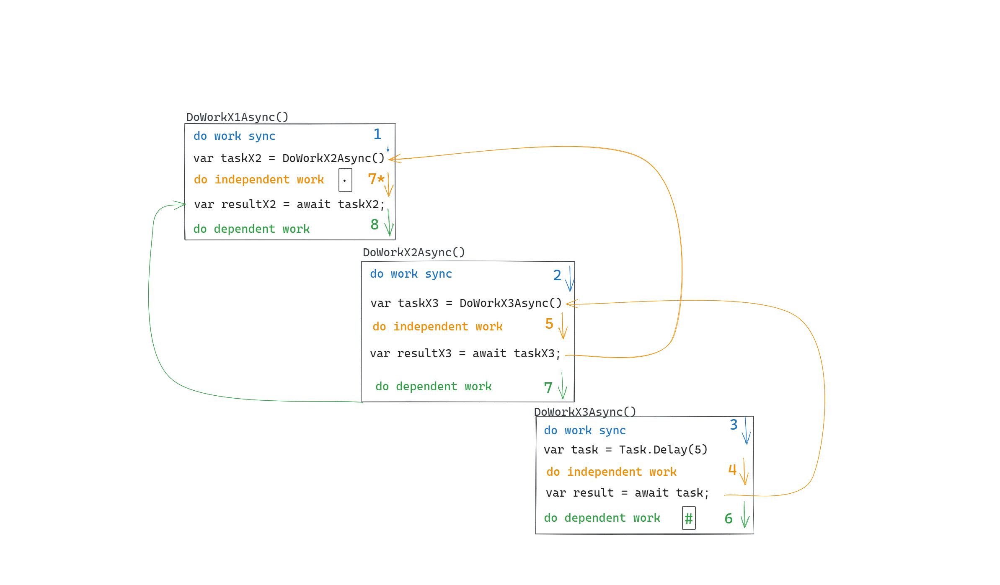

---

### Async await flow

#### Main points

- execution flow is normal until the final blocking operation is hit
<!--
The same thread is executing the code
-->

- returns control to the caller = the called method returns a **Task**

- the on-going independent work is **NOT** interrupted when the final I/O operation is completed

- if a called async method returns a response instantaneously, there's no suspension of the method, the flow is normal

---

## SynchronizationContext
 
---
### Don't Block on Async Code
#### Blocking on an asynchronous code with SynchronizationContext causes deadlock!
<!-- 
E code in wpf, si are deadlock. 
- explain code (handles a btn click)
- cause: no thread can enter because it needs the context
- why the need for SContext?
- UI context - used by UI apps to ensure that code after an await will resume on the UI thread.
 -->

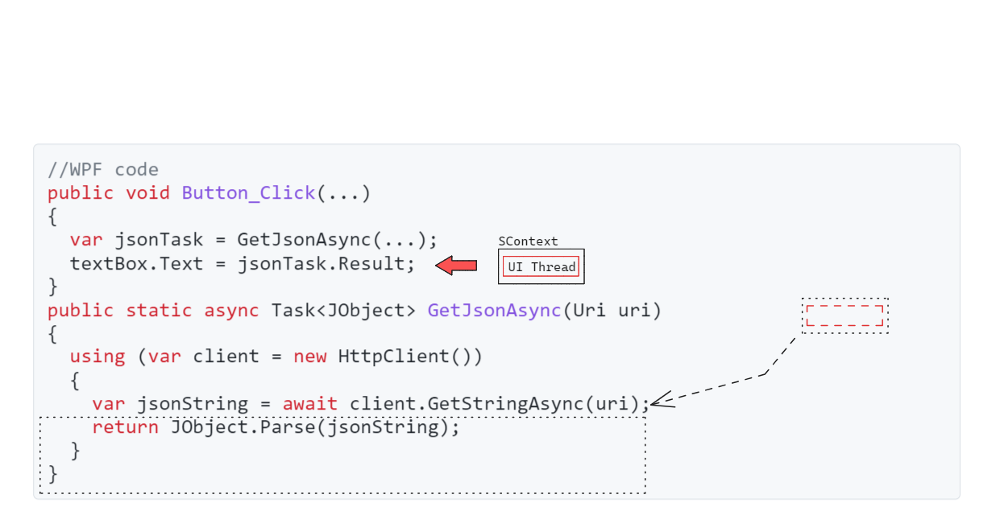 

---

 #### Blocking on an asynchronous code with SynchronizationContext causes deadlock!

- **Asp.Net**: The context gives the culture and identity of the request.
<!-- 
ASP.NET Classic request context - used by ASP.NET Classic to ensure that code after an await will resume with the same request-specific global properties (e.g., HttpContext.Current) 
- The trick to solve?
-->
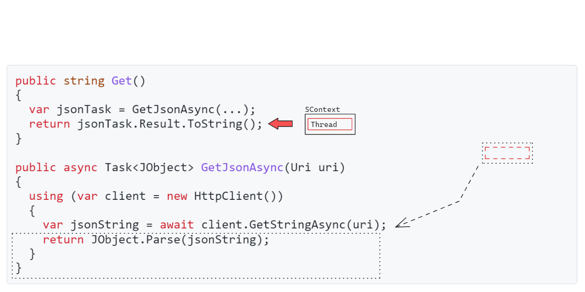

---
#### Blocking on an asynchronous code with SynchronizationContext causes deadlock!
Solution: **ConfigureAwait**(bool continueOnCapturedContext)
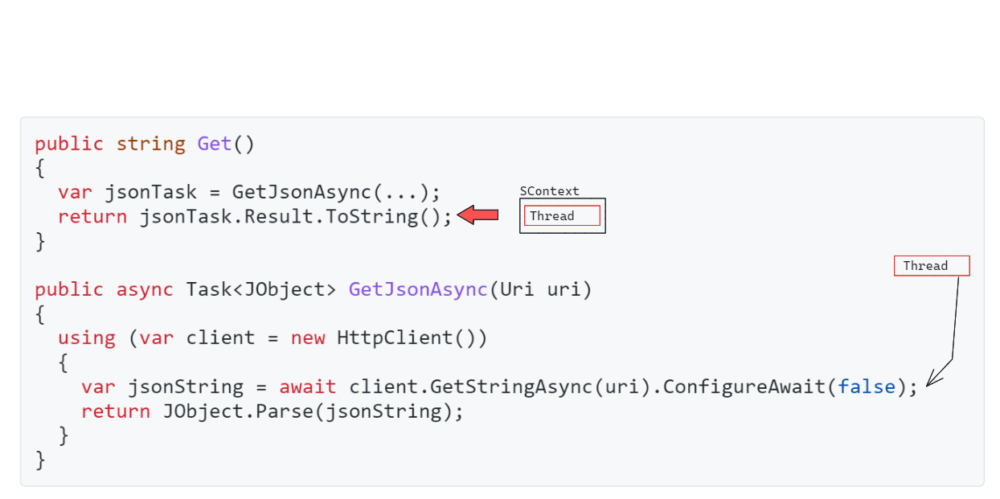

<!-- 
- the context can mean the ui thread or the culture/identity 
-->

---

### SynchronizationContext
> Provides the basic functionality for propagating a synchronization context in various synchronization models. 

- **WPF**: context <-> UI thread

<br/>

- **Asp.Net**: The context gives the culture and identity of the request.

<br/>

- **Asp.Net Core**: There's no SynchronizationContext!

<!-- 
- why explain context 
- paralelizarea anterioara nu e posibila in aspnet
- pentru ce tipuri de apps e context?
-->
---

## Exceptions in async code

---

### Exceptions

**From which code line will the exception be propagated?**
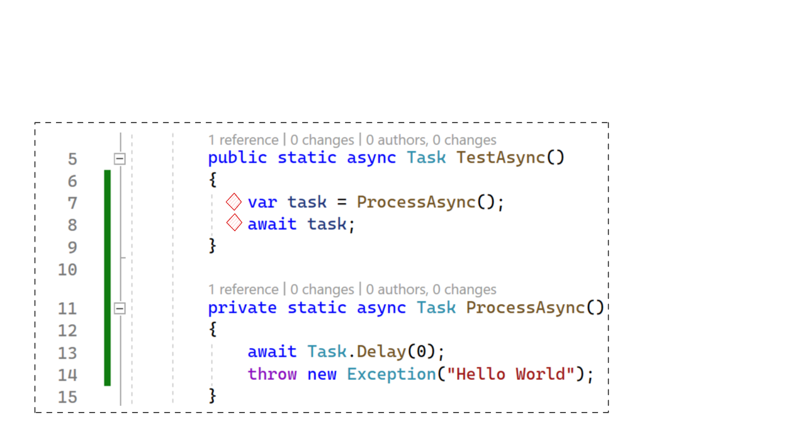

<!-- 
- explain code
-
 -->
---

### Exceptions

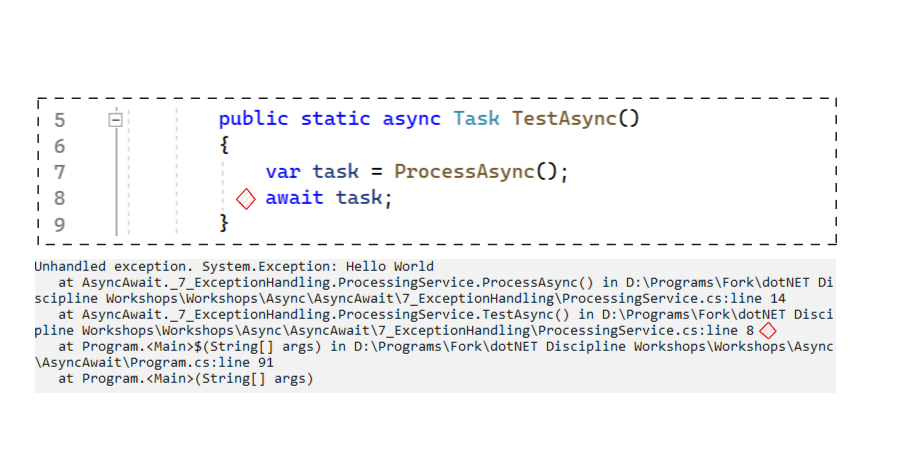

---

### Exceptions

<br/>
<br/>
<br/>
<br/>
<br/>

Unhandled exceptions in async methods are:

- captured and stored on the associated <b>Task</b> (status becomes Faulted)

 - if multiple exceptions occur (e.g., from multiple tasks), they are wrapped in an <b>AggregateException</b> on the Task

 - when you <b>await</b> that Task, the first exception is thrown directly (unwrapped)

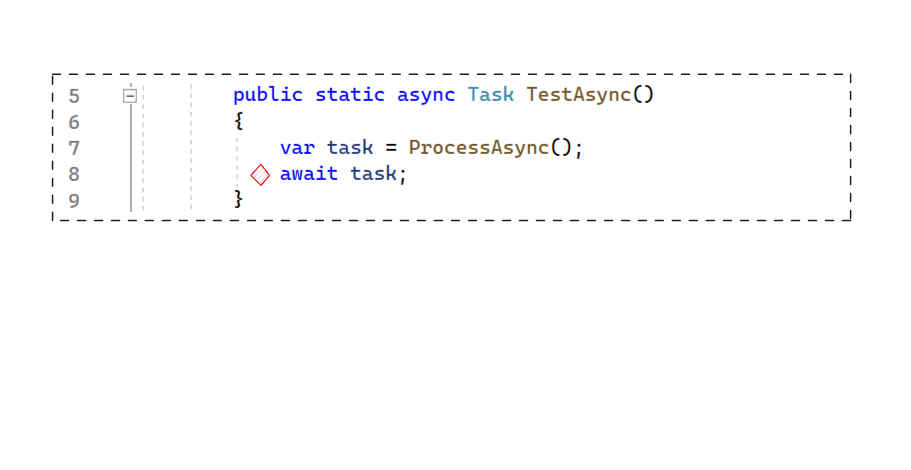

---

### Eliding async/await

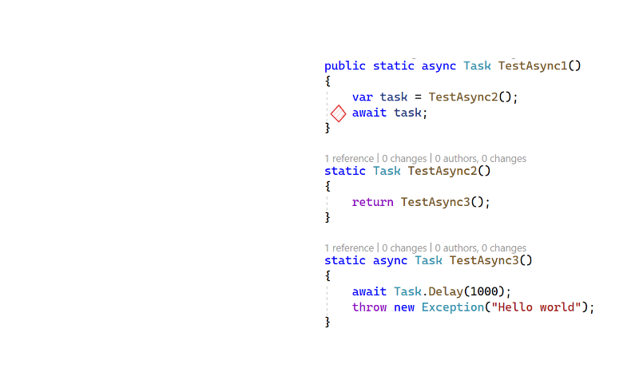
<br/>
#### How will the exception stacktrace look?

<!--
 pentru ca exceptia e pusa pe task si awaitul arunca/ia exceptia de pe task
 - explain code
 - why not use 
-->
---

### Eliding async/await

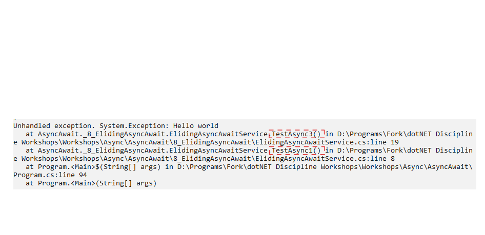

<br/>

- methods that do not use async/await do not appear in the Stacktrace of the exception
<!-- although it optimezes the allocations, the debugging experience is affected -->

---

### Async void

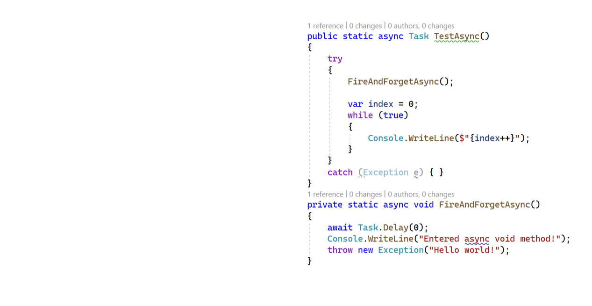

- **NOT** to be used!
- Can not be awaited
  (fire and forget)

- Exceptions thrown from
  async void methods
  can **not** be caught from outside,
  hence they terminate the process.


---
### Async void Demo
<!-- UPDATED -->

---

### Async void

- The async state machine:
  - throws the exception on the syncronization context if there is one
  <br/>
  - if not: it **throws the exception on the threadpool**

  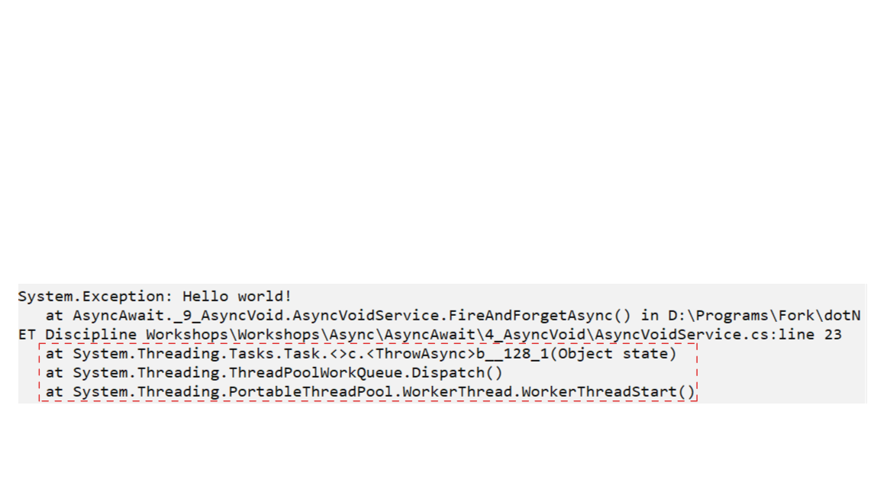

<!-- 
 If we captured a synchronization context, Post the throwing of the exception to it
  and decrement its outstanding operation count. 
  Otherwise, queue the exception to be thrown on the ThreadPool.  This will
  result in a crash unless legacy exception behavior is enabled by a config
  file or a CLR host.
  https://stackoverflow.com/questions/53215577/why-does-exception-from-async-void-crash-the-app-but-from-async-task-is-swallowe#:~:text=Because%2C%20your%20methods%20are%20not,in%20the%20current%20execution%20context.
-->

---

## Async composition

---

### WhenAll

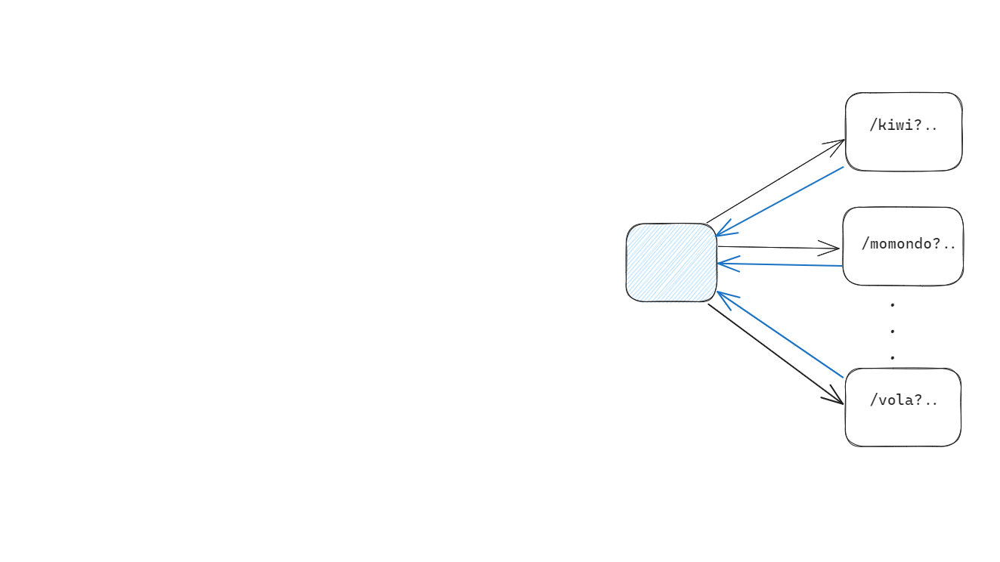

- ` Task WhenAll(IEnumerable<Task> tasks) `
  <br/>
- For a list of tasks, **WhenAll** creates
  a task that completes when all the given
  tasks are completed

- All thrown **exceptions** are available
  on the _aggregation_ task

<!-- 
exemple 
bilete de avion
- take care where When.All is used
- start all tasks, but whenall is more clean
 -->
---

### WhenAll Demos

---

### WhenAny

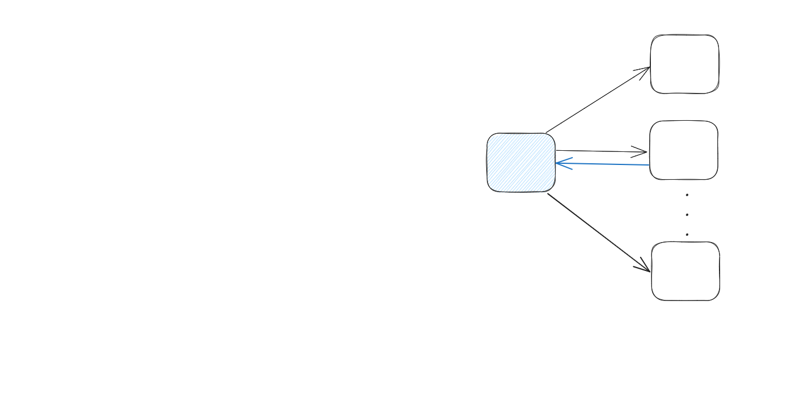

- For a list of Tasks, **WhenAny** creates a Task
  that completes when the first Task
  completes

<br/>

- Even if one task returns, the remaining tasks
  will continue to run

---

### WhenAny

- The response type is **Task<Task>**/**Task<Task<TResult>>**,
  **NOT** the result of the first Task to complete

```c#
    public static async Task ProcessAsync()
    {
        var tasks = _list.Select(url => ProcessDataFromUrlAsync(url));

        var completedTask = await Task.WhenAny(tasks);

        var result = await completedTask;
    }
```

<!--
diagram ?

https://www.davidguida.net/exception-handling-in-parallel-tasks/
-->
---
### WhenAny Demo
<!-- show that the other tasks run even ifone task completed -->
---

### WhenAll and WhenAny - Exercise
<br/>

- Replace **Task.WhenAll** with **Task.WhenAny** to process the results in the order they are completed.

---
## Cancellation tokens
---

### Cancellation tokens
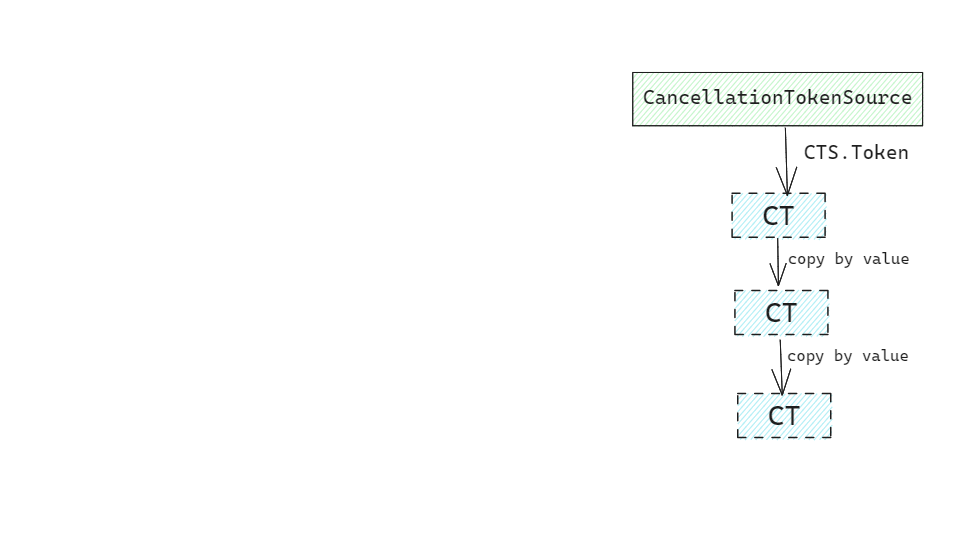

- Instantiate a **CancellationTokenSource** object

- Pass the token returned by the **CancellationTokenSource**.**Token**

- Provide a mechanism for each method that receives a token
 to respond to cancellation. 
    - Cancellation should result in a thrown exception 
 of type **OperationCanceledException**. 
      - token.IsCancellationRequested 
<br/>
      - token.ThrowIfCancellationRequested
-  Call **cts**.**Cancel** to provide notification of cancellation

---

### Cancellation tokens
<!-- updated -->
```c#
public class TimedPrimeNumberAlgorithm : ICompletePrimeNumberAlgorithm
{
  private readonly ICompletePrimeNumberAlgorithm _algorithm;

  ...

  public bool IsPrime(ulong number, CancellationToken token)
  {
      using var cts = new CancellationTokenSource();

      cts.CancelAfter(10000);

      return _algorithm.IsPrime(number, token);
  }
}
```
<!--
https://andrewlock.net/using-cancellationtokens-in-asp-net-core-minimal-apis/
https://blog.stephencleary.com/2022/02/cancellation-1-overview.html
https://learn.microsoft.com/en-us/dotnet/standard/parallel-programming/task-cancellation
 -->
---
### CancellationTokens in ASP.NET Core - Demo

---
### CancellationToken - Exercise
<!-- UPDATED -->
**Respond to cancellation in a long running synchronous operation**
Having an endpoint that receives a number as query parameter, use **CancellationToken** to respond to the cancellation issued when the user resends the request.
*/isPrime?number=__67280421310721__*

```c
INPUT n
i = 2
isPrime = true

WHILE i <= n / 2
    IF n % i != 0
        i = i + 1
    ELSE
        isPrime = false
        END WHILE
OUTPUT isPrime
```

---
 ### Cancellation tokens

- Pass the token all the way

- *ASP.NET Core* offers cancellation tokens in action methods

- Dispose CancellationTokenSource 

- Is a cooperative method of cancelling, the token source signals
 the cancellation but the called methods must:
    - pass the token to library/framework methods
    - check and throw exception (long running sync work)


---

## Allocation optimizations

---

### ValueTask<TResult>

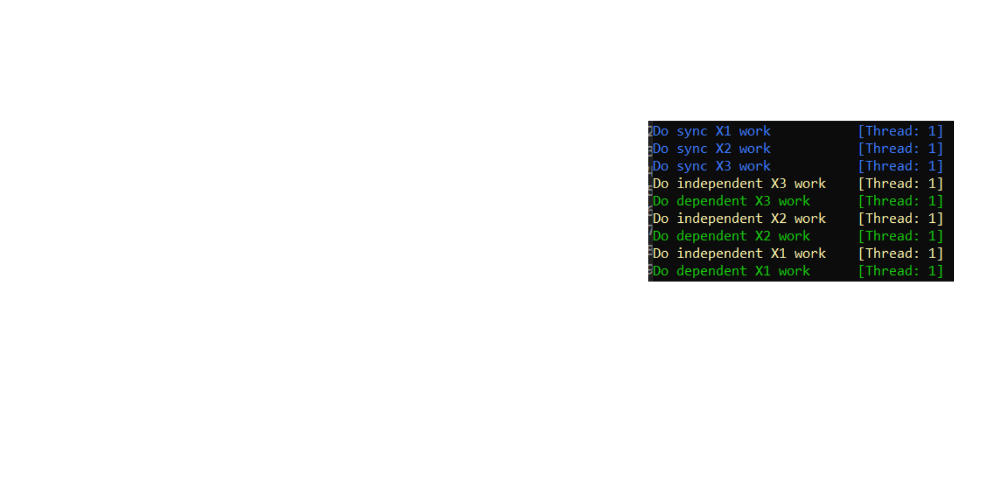

- struct
  <br/>
- wraps **TResult** if the function
  completes synchronously and successfully
  <br/>
- wraps **Task<TResult>** if the function
  completes asynchronously

---
### ValueTask<TResult>

- Buffering
```c#
public async ValueTask WriteAsync(byte value)
{
    if (_bufferedCount == _buffer.Length)
    {
        await FlushAsync();
    }
    _buffer[_bufferedCount++] = value;
}
```
---

### ValueTask<TResult>

- Caching token
  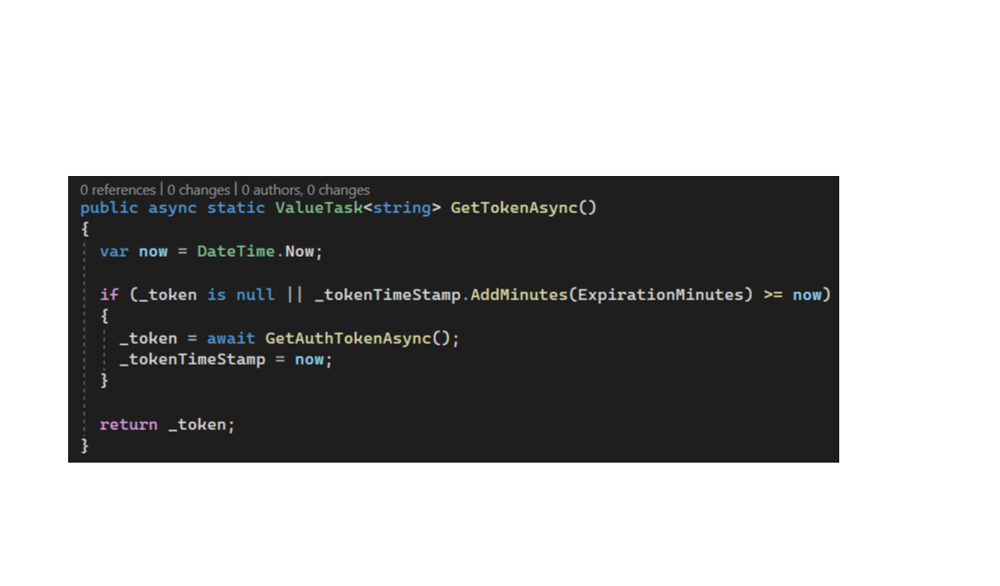

<!--
- Caching Task
- When to use ValueTask?
https://devblogs.microsoft.com/dotnet/understanding-the-whys-whats-and-whens-of-valuetask/
https://tooslowexception.com/implementing-custom-ivaluetasksource-async-without-allocations/
https://code-maze.com/csharp-task-and-valuetask/
-->
---

### ValueTask<TResult> Dont's

_**Never**_ perform these operations:

- Awaiting the instance multiple times.
```C#
public aync ValueTask<Token> GetTokenAsync(){...}

public async Task DoSomething(){
  var valueTask = GetTokenAsync();
  await valueTask;
  await valueTask;
}
```
---
### ValueTask<TResult> Dont's
- Calling **AsTask** multiple times.

- Using more than one of these techniques to consume the instance.
```C#
public aync ValueTask<Token> GetTokenAsync(){...}

public async Task DoSomething(){
  var valueTask = GetTokenAsync();
  var task = valuTask.AsTask();

  var result1 = await valueTask;
  var result2 = await task;
}
```
---
### ValueTask<TResult> Dont's
- Using **.Result** or **.GetAwaiter().GetResult()** when the operation hasn't yet completed, or using them multiple times.
<br/>

```C#
public aync ValueTask<Token> GetTokenAsync(){...}

public async Task DoSomething(){
  var valueTask = GetTokenAsync();
  var result = valueTask.Result;
}
```

---

### IValueTaskSource

<style scoped>
table {
  font-size: 24px;
}
</style>

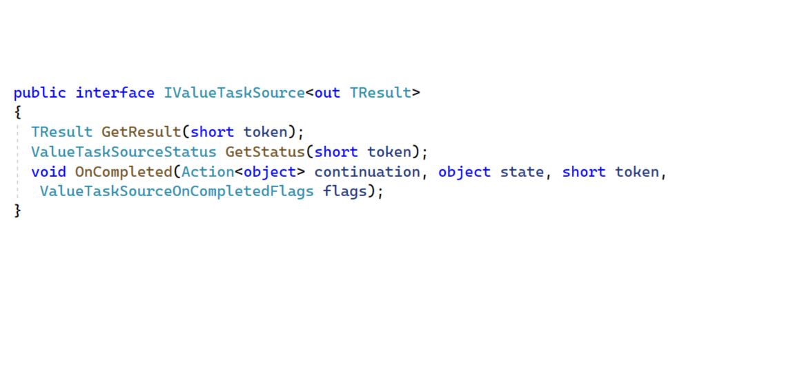
<br/>
<br/><br/><br/>

```c#
IValueTaskSource<int> vts = …;
return new ValueTask<int>(vts);
```

<!--
* **GetResult** - Gets the result of the IValueTaskSource<TResult>.
* **GetStatus** - Gets the status of the current operation.
* **OnCompleted** - Schedules the continuation action for this IValueTaskSource<TResult>

Provides types for creating **ValueTask** and **ValueTask<TResult>** optimized to minimize allocations. The **IValueTaskSource** and **IValueTaskSource<TResult>** interfaces can be implemented on objects used to provide the backing implementations for ValueTask and ValueTask<TResult>, and ManualResetValueTaskSourceCore<TResult> can be used to implement the core logic necessary to support the task lifecycle.

These are advanced types and
need only be used in specialized situations
where performance is paramount

Implementation that used IValueTaskSource:
- NetworkStream
- AwaitableSocketAsyncEventArgs
- AsyncOperation<TResult>
- DefaultPipeReader

https://stackoverflow.com/questions/75241303/whats-the-right-way-to-implement-valuetasksource-setcompleted

https://tooslowexception.com/implementing-custom-ivaluetasksource-async-without-allocations/

https://stackoverflow.com/questions/69147931/avoiding-allocations-and-maintaining-concurrency-when-wrapping-a-callback-based

manuralreset wrapper - https://www.appsloveworld.com/csharp/100/1053/awaiting-a-single-net-event-with-a-valuetask

mual reset wrapper - https://stackoverflow.com/questions/73043374/how-to-pause-resume-an-asynchronous-worker-without-incurring-memory-allocation
-->

---

## Wrapping legacy asynchronous code

---

### TaskCompletionSource

<!--
https://www.pluralsight.com/guides/task-taskcompletion-source-csharp
-->

Can wrap an asynchronous operation. **TaskCompletionSource** is a source of tasks and of completion of the created task.
<br/>
_Methods_:

- SetResult() / **Try**SetResult() -> RanToCompletion status
- SetException() / **Try**SetException() -> Faulted
- SetCanceled() / **Try**SetCancelled() -> _**Cancelled**_

---

### Callback asynchronous to Task (AMP to TAP)

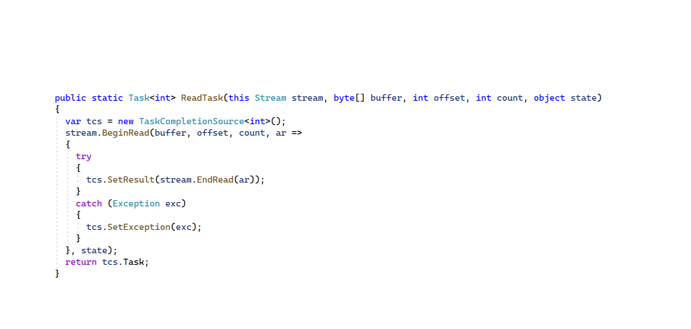

---

### Event asynchronous to Task (EAP to TAP)


---

### TaskCompletionSource

- The _"continuation"_ of the newly created task is inlined

 <br/>


<!-- ---

### TaskCompletionSource - Demo -->

---

### TaskCompletionSource

- Can be used to "asyncify" legacy code
<br/>
- May cause deadlocks by running all continuations on the thread that sets the result of a task
<br/>
- Always use **TaskCreationOptions**.**RunContinuationsAsynchronously** for creating an instance

---

## Async streams
---
### Async streams
- IAsync**Enumerable**<T>
- IAsync**Enumerator**<T>
- IAsyncDisposable
```c#
static IEnumerable<int> Range(int start, int count)
{
  for (int i = 0; i < count; i++)
  yield return start + i;
}
...
foreach (int item in Range(10, 3))
  Console.Write(item + " "); // prints 10 11 12
```

---
### Async streams - Demo

---
### Conclusions
- Unhandled exceptions are caught by the *async state machine* and put on the **Task**
- **Don't** use async void
- **WhenAll** is usefull when the result from multiple requests is needed
- The framework provides **cancellation tokens** to action methods
- Use **ValueTask** when is more probable that a method completes synchronously
- Legacy code can be *asyncified* with **TaskCompletionSource**
- Always use **TaskCreationOptions.RunContinuationsAsynchronously** for creating **TaskCompletionSource**
- Use **async streams** when data can be available in batches
---
## Thank you!

